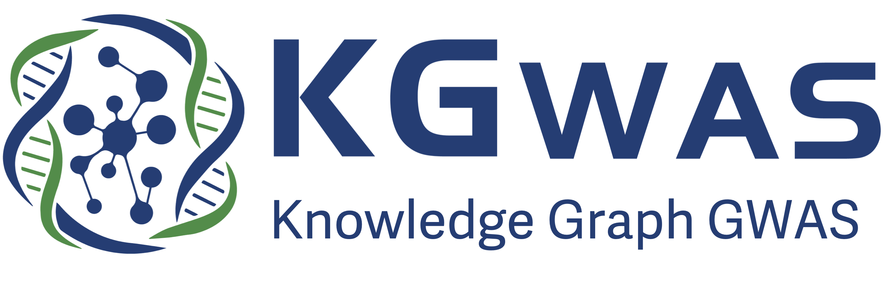

<p align="center"></p>

# Genetics discovery powered by massive multi-modal and multi-scale functional genomics knowledge graph

[**Preprint**](https://www.medrxiv.org/content/10.1101/2024.12.03.24318375v1) | [**Website**](https://kgwas.stanford.edu/) | [**Talk at Stanford Graph Learning Workshop**](https://youtu.be/0_jdg7FqSE4?si=3dZci2jdIFjSukJh)

Genome-wide association studies (GWASs) have identified tens of thousands of disease-associated variants and provided critical insights into developing effective treatments. However, limited sample sizes have hindered the discovery of variants for less common and rare diseases.
Here, we introduce KGWAS, a novel geometric deep learning method that leverages a massive functional knowledge graph across variants and genes to improve detection power in small-cohort GWASs significantly.

## Installation

Install Pytorch Geometric by following [this instruction](https://pytorch-geometric.readthedocs.io/en/latest/install/installation.html) and then do:

```bash
pip install KGWAS
```

## Core KGWAS API Usage

```python

from kgwas import KGWAS, KGWAS_Data
data = KGWAS_Data(data_path = './data') ## initialize KGWAS data class with data path

data.load_kg() ## load the knowledge graph
data.load_external_gwas(PATH) ## load the GWAS file
data.process_gwas_file() ## process the GWAS file
data.prepare_split() ## prepare the train/val/test split

run = KGWAS(data, device = 'cuda:0', seed = 1) ## initialize KGWAS model
run.initialize_model()

run.train(epoch = 10) ## train the model
```

## Data download
To ensure fast user experience, we provide a default fast mode of KGWAS, which uses Enformer embedding for variant feature and ESM embedding for gene features (instead of the baselineLD for variant and PoPS for gene since they are large files). For the fast mode, you do not need to download any data, the KGWAS API will automatically download the relevant files. This mode can be used to apply KGWAS to your own GWAS sumstats. 

If you want to (1) use the full mode of KGWAS (i.e. larger node embeddings) or (2) access the null/causal simulations or (3) access the 21 subsampled GWAS sumstats across various sample sizes or (4) analyze the KGWAS sumstats for subsampled data or (5) analyze the KGWAS sumstats for all UKBB ICD10 diseases, please use [this link](https://drive.google.com/file/d/14UcHzPRIbdMmnLPZCHx_4G-gz2pipeg9/view?usp=sharing). Note that this file is large (around 55GB) and may take a while to download. 

## Tutorial

| Notebook | Description                                             |
|----------|---------------------------------------------------------|
| [Introduction](demo/kgwas_101.ipynb)  | Tutorial on key KGWAS API and functionalities including on applying KGWAS to your own sumstats. |
| [Simulation analysis](demo/kgwas_simulation.ipynb)   | Tutorial on the simulation analysis. |
| [Subsampling analysis](demo/kgwas_subsampling.ipynb)  | Tutorial on the subsampling analysis. |
| [Disease critical network](demo/disease_critical_network.ipynb)  | Tutorial on generating disease critical network. |
| [MAGMA analysis](demo/run_magma.ipynb)  | Tutorial on the generating gene-level association scores. |


## Extended API Usage

#### `KGWAS_Data` class

`data = KGWAS_Data(data_path = './data')`
- `data_path`: specify the path to the data folder. If not specified, the default path is `./data`. If you use the full mode, unzip the data and use the path to the unzipped folder.

`data.load_kg(snp_init_emb = 'enformer', go_init_emb = 'random', gene_init_emb = 'esm', sample_edges = False, sample_ratio = 1)`: load KGWAS knowledge graph and node embeddings
- `snp_init_emb`: specify the variant embedding method. Options are `enformer` (default), `baselineLD`, `SLDSC`, `cadd`, `kg`, `random`
- `go_init_emb`: specify the gene ontology embedding method. Options are `random` (default), `biogpt`, `kg`
- `gene_init_emb`: specify the gene embedding method. Options are `esm` (default), `pops_expression`, `pops`, `kg`, `random`
- `sample_edges`: whether to sample edges from the knowledge graph. Default is `False`
- `sample_ratio`: the ratio of edges to sample. Default is `1`

`data.load_external_gwas(path, seed = 42)`: load external/your own GWAS file
- `path`: specify the path to the GWAS file; The expected columns are CHR, SNP, P, N, and SNP should be in rs ID. 
- `seed`: specify the seed for the data split. Default is `42`

`data.load_full_gwas(pheno, seed)`: load full-cohort GWAS files already run in KGWAS. Note that this requires full data download.
- `pheno`: specify the phenotype to load. Use `data.get_pheno_list()` to see all available phenotypes.

`data.load_gwas_subsample(pheno, sample_size, seed)`: load subsampled GWAS files already run in KGWAS. Note that this requires full data download.
- `pheno`: specify the phenotype to load. Use `data.get_pheno_list()["21_indep_traits"]` to see all available phenotypes.
- `sample_size`: specify the sample size to load, it is available in 1000, 2500, 5000, 7500, 10000, 50000, 100000, 200000.
- `seed`: specify the seed for the data split. It is available in 1,2,3,4,5.

`data.load_simulation_gwas(simulation_type, seed)`: load the null and causal simulation data
- `simulation_type`: specify the simulation type. Options are `null` and `causal`.
- `seed`: specify the seed for the data split. It ranges from 1-500.

`data.process_gwas_file()`: process the GWAS file for training

`data.prepare_split(test_set_fraction_data = 0.05)`: prepare the train/val/test split
- `test_set_fraction_data`: specify the fraction of data to use as the test set. Default is `0.05`

#### `KGWAS` class

`run = KGWAS(data, weight_bias_track = False, device = 'cuda', proj_name = 'KGWAS', exp_name = 'KGWAS', seed = 42)`: initialize KGWAS model
- `data`: specify the KGWAS data class
- `weight_bias_track`: whether to track the weight and bias during training. Default is `False`
- `device`: specify the device to run the model. Default is `cuda`
- `proj_name`: specify the project name. Default is `KGWAS`
- `exp_name`: specify the experiment name. Default is `KGWAS`
- `seed`: specify the seed for the model. Default is `42`

`run.initialize_model(gnn_num_layers = 2, gnn_hidden_dim = 128, gnn_backbone = 'GAT', gnn_aggr = 'sum', gat_num_head = 1)`: initialize the KGWAS model
- `gnn_num_layers`: specify the number of GNN layers. Default is `2`
- `gnn_hidden_dim`: specify the hidden dimension of the GNN. Default is `128`
- `gnn_backbone`: specify the GNN backbone. Options are `GAT` (default), `GCN`, `SAGE`, `SGC`
- `gnn_aggr`: specify the GNN aggregation method. Options are `sum` (default), `mean`, `min`, `max`, `cat`
- `gat_num_head`: specify the number of GAT heads. Default is `1`

`run.load_pretrained(path)`: load pretrained model
- `path`: specify the path to the pretrained model

`run.train(batch_size = 512, num_workers = 6, lr = 1e-4, weight_decay = 5e-4, epoch = 10, save_best_model = False, save_name = None, data_to_cuda = False)`: train the model
- `batch_size`: specify the batch size. Default is `512`. If you get CUDA OOM error, you can reduce the batch size.
- `num_workers`: specify the number of workers for data loading. Default is `6`
- `lr`: specify the learning rate. Default is `1e-4`
- `weight_decay`: specify the weight decay. Default is `5e-4`
- `epoch`: specify the number of epochs. Default is `10`
- `save_best_model`: whether to save the best model. Default is `False`
- `save_name`: specify the name to save the model. Default is `run.exp_name`
- `data_to_cuda`: whether to move the data to CUDA. Default is `False`. You will be faster if you set it to `True` but will take a bit more CUDA memory.

## Cite Us

```bibtex
@article{kgwas,
  title={Small-cohort GWAS discovery with AI over massive functional genomics knowledge graph},
  author={Huang, Kexin and Zeng, Tony and Koc, Soner and Pettet, Alexandra and Zhou, Jingtian and Jain, Mika and Sun, Dongbo and Ruiz, Camilo and Ren, Hongyu and Howe, Laurence J and others},
  journal={medRxiv},
  pages={2024--12},
  year={2024},
  publisher={Cold Spring Harbor Laboratory Press}
}
```
